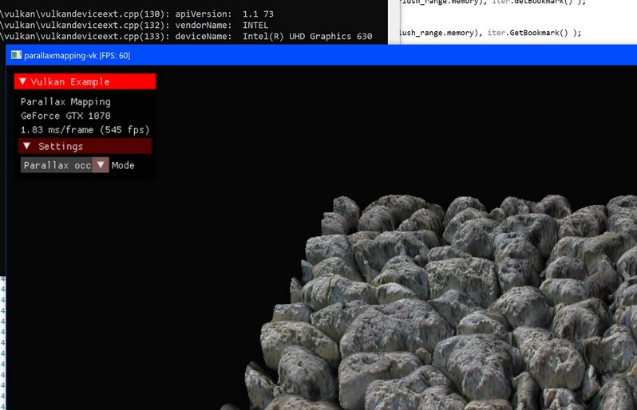
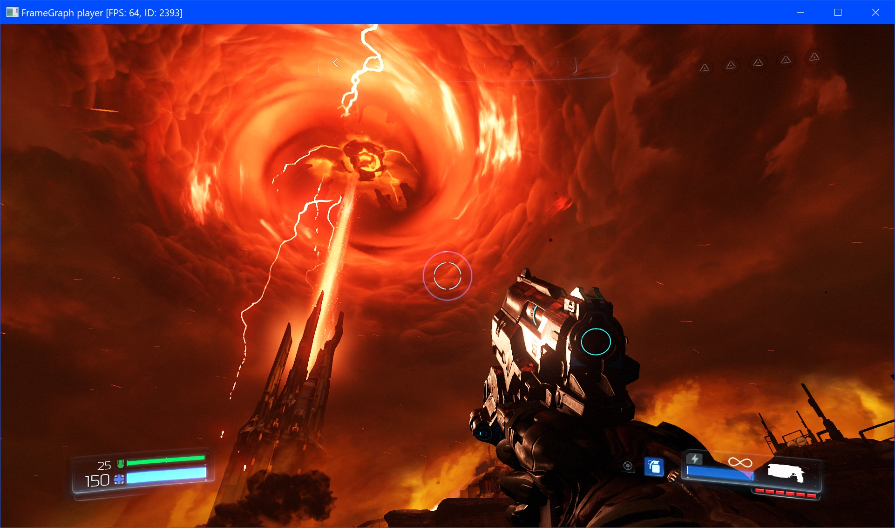
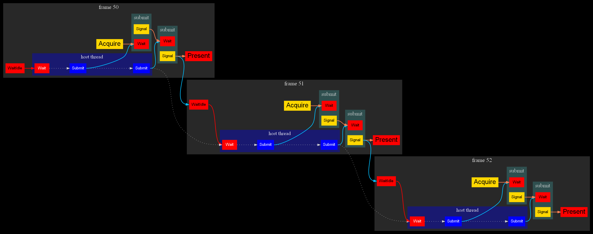
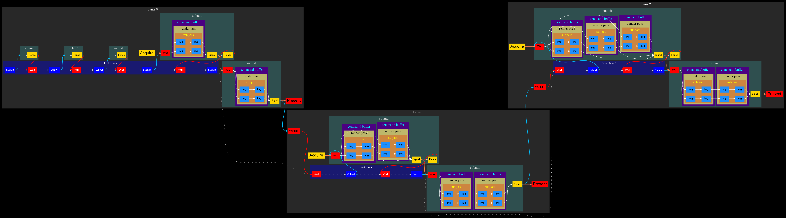
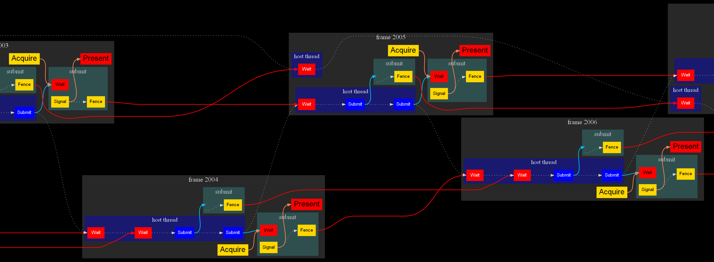

# Console commands examples

## Convert to trace without modifications
```
--convert    vk-trace
--open       parallaxmapping.vktrace
--output-dir converted
```
In the `converted/vk-trace` folder there are 2 files: `main.cpp` and `CMakeLists.txt`.
To run player you need VTPlayer shared library (.dll or .so) and original vktrace file, becouse large data is not copied to new trace.<br/>
**Warning:** you can not run this trace on other GPU then used for vktrace recording and you can not resize the window.


## Convert to portable trace
```
--convert       vk-trace
--cfg-vk-trace  indirect-swapchain=true  remap-mem=true
--open          parallaxmapping.vktrace
--output-dir    converted
```
Now you can resize window, becouse frame rendered to intermediate image and then blitted to swapchain image.
Also you can run player on any GPU, becouse memory allocation overrided.<br/>
(queue remapping for full portability is in progress, but for both application it is not needed)




## Convert to FrameGraph trace
```
--convert       fg-trace
--cfg-fg-trace  force-dbo=true
--open          doom.vktrace
--output-dir    converted
```
Converts vulkan api calls into [FrameGraph](https://github.com/azhirnov/FrameGraph) api calls.
`force-dbo=true` can be used to convert all UBOs and SSBOs with dynamic offset.




## Convert to C++ source code
```
--convert       vk-cpp
--cfg-vk-cpp    begin=3098  end=3099
--open          doom.vktrace
--output-dir    converted
```
You can inspect some frames or convert full trace (by removing `begin` and `end` commands) and get fully editable application source code, but usualy there is a megabytes of code and compilation may take a lot of time.<br/>
Result: [doom-Frame3098](doom-Frame3098.cpp.txt)


## Convert to C++ source code with dividing by threads
```
--convert       vk-cpp
--cfg-vk-cpp    begin=3102  end=3103  divide-by-threads
--open          doom.vktrace
--output-dir    converted
```
Same as above, but vulkan api calls grouped by thread.<br/>
**Warning:** threre is incorrect execution order, so application may not work correctly.<br/>
Result: [doom-Frame3102](doom-Frame3102.cpp.txt)


## Convert to synchronization graph and visualize
```
--convert       graphviz
--cfg-graphviz  begin=0  end=3  show-sync=true
--open          parallaxmapping.vktrace
--output-dir    converted
```
The output in the `converter/graphviz` will be `sync-graph-0-3.dot` and, if [graphviz](https://www.graphviz.org/) installed, `sync-graph-0-3.dot.png`.<br/>
<br/>
Legend:<br/>
yellow boxes - includes semaphore signaling.<br/>
red boxes - includes semaphore (in queue) or fence (in host) waiting, or WaitIdle command.<br/>
orange lines - connects semaphore signal and wait sycnhronizations.<br/>
red lines - connects synchronizations with host (wait idle, wait fence).<br/>
dotted lines - execution order.<br/>
blue lines - command submision order.<br/>

[parallazmapping sample](https://github.com/SaschaWillems/Vulkan/tree/master/examples/parallaxmapping) synchronizations:


[multithreading sample](https://github.com/SaschaWillems/Vulkan/tree/master/examples/multithreading) synchronizations (pipeline barriers visualization enabled):


Doom synchronizations:

